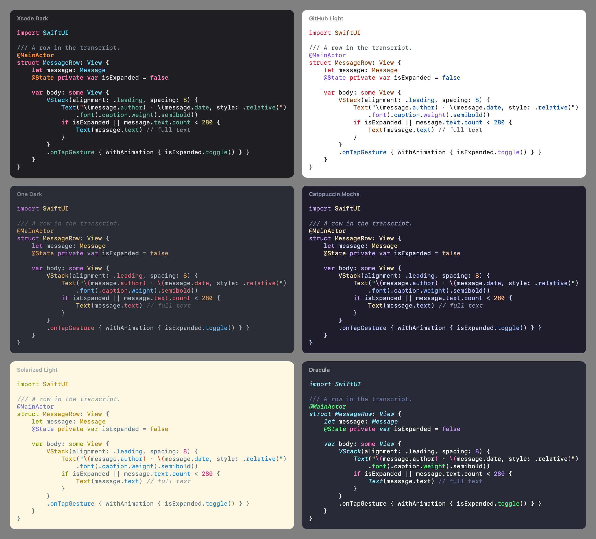
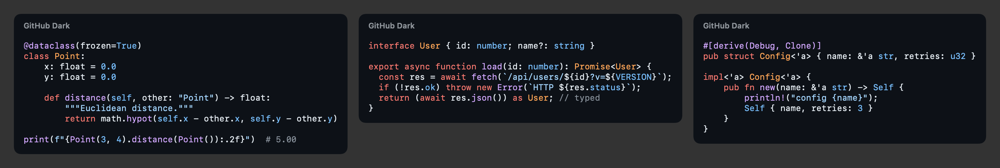

# SwiftHighlight

[](https://github.com/CreatureSurvive/SwiftHighlight/actions/workflows/ci.yml)
[](https://swift.org)
[](#requirements)
[](#installation)
[](LICENSE)

A fast, pure-Swift syntax highlighter for 33 languages. It has 13 themes and imports VS Code and
TextMate themes. It updates incrementally for editors and streamed text, and it renders to
SwiftUI, UIKit/AppKit, HTML and the terminal. It has no dependencies and embeds no JavaScript
engine.

```swift
import SwiftHighlight

CodeView(source, language: "swift", theme: .github)          // SwiftUI

let code = Language.swift.highlight(source)
Text(code.attributedString(theme: .xcode))                     // AttributedString
textView.attributedText = code.nsAttributedString(theme: .one, font: .monospacedSystemFont(ofSize: 13, weight: .regular))
let html = code.html(theme: .githubDark)                       // self-contained HTML
print(code.ansi(theme: .dracula))                              // 24-bit terminal colors
```





Regenerate these with `SCREENSHOTS_DIR=$PWD/Screenshots swift test --filter ScreenshotTests`.

## Why

The usual options on Apple platforms:

- **Wrappers around highlight.js** (Highlightr and friends) run a JavaScript engine. They add
  JavaScriptCore start-up time and bridging costs to every call, and JavaScriptCore is unavailable
  on watchOS.
- **Tree-sitter** (Runestone, Neon) is excellent for editors. It needs a compiled C parser per
  language and is heavy for a chat bubble or a code block in a list.
- **Hand-written highlighters** cover one language (Splash covers Swift) or reduce to keyword lists.

SwiftHighlight runs **declarative grammars** on a purpose-built engine. Adding a language is a
small Swift or JSON file. Throughput is 40–130 MB/s per language on a laptop. Highlighting is
line-incremental, so it serves both a static code block and a live editor.

## Features

- **33 languages**: Swift, Objective-C, C, C++, C#, Java, Kotlin, Dart, Go, Rust, JavaScript
  (with JSX), TypeScript, TSX, JSON, HTML (with embedded JS and CSS), XML, CSS, SCSS/Less, GraphQL,
  Python, Ruby, PHP, Lua, Shell, YAML, TOML, INI, SQL, Protocol Buffers, Dockerfile, Makefile, Diff,
  and Markdown, whose fenced code blocks are highlighted in their own language. There are over 350
  aliases, extensions and file names, plus shebang and `<?xml` detection.
- **Real lexical structure**: nested and doc comments; string interpolation to any depth
  (`"\(f("\(x)"))"`, `` `${a ? `${b}` : c}` ``, `f"{x!r:>10}"`); raw strings, heredocs and fences
  whose closing delimiter must repeat the opening one (`#"…"#`, `r##"…"##`, `<<EOF`, `[==[ ]==]`);
  regex literals; embedded languages.
- **13 themes**: Xcode, GitHub, One, Solarized, Catppuccin (each light and dark), Dracula, Monokai
  and Nord. Light/dark pairs render to dynamic colors that follow the system appearance.
- **Customizable themes**: `Codable`, per-scope styles with TextMate-style inheritance, and import
  of **VS Code** (`*-color-theme.json`, comments allowed) and **TextMate/Sublime** (`.tmTheme`)
  themes.
- **Custom languages**: grammars are `Codable` values written in Swift or JSON and registered at
  runtime. Built-ins can be copied and extended.
- **Incremental highlighting** (`HighlightSession`): an edit re-tokenizes only until line states
  converge. Streaming `append` re-tokenizes only the tail.
- **Renderers**: SwiftUI `AttributedString` and `CodeView`; UIKit/AppKit `NSAttributedString`;
  HTML with inline styles, or classes plus generated CSS with light/dark media queries; ANSI
  true-color and 256-color output.
- **Safe on hostile input**: tokenizing time is metered per line, so no grammar or input can go
  superlinear. Stack depth is capped, tokens always fall on Unicode scalar boundaries, and the whole
  engine is fuzzed.
- **Thread-safe**: `Language`, `Theme` and `Grammar` are immutable `Sendable` values, so you can
  highlight from any thread or actor.

## Performance

Measured on an Intel Core i9-9880H (2019 MacBook Pro), release build, single thread. The corpora
are real code from this machine: SDK C headers, the Python standard library, Rust, TypeScript and
Swift projects, JSON and Markdown.

| Language | Throughput |  | Language | Throughput |
| --- | ---: | --- | --- | ---: |
| Swift | 73–79 MB/s | | Rust | 66 MB/s |
| TypeScript | 79 MB/s | | Markdown | 62 MB/s |
| Objective-C / C headers | 80 MB/s | | JSON | 57 MB/s |
| JavaScript | 65 MB/s | | TOML / YAML | 42–46 MB/s |
| SQL | 133 MB/s | | Python | 39 MB/s |
| CSS | 94 MB/s | | HTML (with JS/CSS) | 41 MB/s |

On 1.7 MB of Swift:

| Operation | Time |
| --- | ---: |
| Tokenize | 23 ms |
| One-character edit in a 41,795-line `HighlightSession` | 83 µs |
| HTML, inline styles | 21 ms |
| ANSI | 13 ms |
| `NSAttributedString` | 148 ms (bound by Foundation's attribute storage) |

For comparison, OpenSwift's previous hand-written Swift highlighter tokenized the same corpus at
1 MB/s.

Run the benchmarks on your own code:

```sh
swift run -c release SwiftHighlightBenchmarks --renderers path/to/sources
```

How it gets there:

- Patterns compile to bytecode for a backtracking VM that works on raw UTF-8 through flat POD
  tables: no ARC and no bounds-checked collections in the inner loop.
- Each state gets a 256-entry **first-byte dispatch table**, so a position only tries the rules
  that can start with its byte. Text that no rule can start is skipped a word at a time using a
  per-state byte-class table.
- Literal rules (`"`, `*/`) are matched with a byte compare, and literal prefixes are
  pre-checked. Consecutive keyword rules merge into one hash lookup that carries a scope per word.
  Identifier scans skip the VM entirely.
- **Automatic possessification**: when nothing that follows a greedy repeat could start with a
  character it consumed, the compiler makes it possessive. `\w+(?=\s*\()` then tries its lookahead
  once instead of once per character.
- Renderers merge runs that resolve to the same style, and fold whitespace into the neighboring
  run. They build attributed strings through CoreFoundation with prebuilt attribute
  dictionaries.

## Installation

```swift
dependencies: [
    .package(url: "https://github.com/CreatureSurvive/SwiftHighlight.git", from: "1.0.0"),
],
targets: [
    .target(name: "App", dependencies: ["SwiftHighlight"]),
]
```

## Usage

### Finding a language

```swift
Language.swift                                   // built-in accessors
Language.named("ts")                             // id, name, alias or extension; plain text if unknown
LanguageRegistry.shared.language(forPath: "Sources/App/View.swift")
LanguageRegistry.shared.language(named: "```python title=x")  // Markdown fence labels work
LanguageRegistry.shared.detect(path: "script", content: "#!/usr/bin/env python3\n…")
```

### SwiftUI

```swift
CodeView(snippet, language: .python, theme: .catppuccin)
    .padding()
    .clipShape(RoundedRectangle(cornerRadius: 8))
```

`CodeView` highlights small snippets synchronously and caches the result. Code over 32 KB is
highlighted off the main actor. For full control, render an `AttributedString` yourself:

```swift
let attributed = Language.swift.highlight(source).attributedString(theme: .xcode)  // AdaptiveTheme: dynamic colors
Text(attributed).font(.system(.callout, design: .monospaced))
```

Bold and italic use inline presentation intents, so they combine with whatever font the `Text`
uses.

### UIKit and AppKit

```swift
let font = UIFont.monospacedSystemFont(ofSize: 14, weight: .regular)
textView.attributedText = Language.json.highlight(source).nsAttributedString(theme: .github, font: font)
textView.backgroundColor = AdaptiveTheme.github.platformBackground
```

### Streaming and editing

`HighlightSession` keeps each line's tokens and end state. It re-tokenizes from the first changed
line and stops once a line ends in the same state as before:

```swift
let session = HighlightSession(language: .markdown)

for try await chunk in response {          // an LLM streaming Markdown
    let changedLines = session.append(chunk)
    render(session.highlightedCode)        // or redraw only `changedLines`
}

// Editors: replace any UTF-8 range, or a String.Index range of the current text.
session.replace(utf8Range: 120..<125, with: "value")
session.tokens(inLine: 42)                 // absolute offsets
session.lineRelativeTokens(inLine: 42)     // offsets within the line
```

To tokenize line by line yourself (a text view's layout pass or a log viewer), use
`LineTokenizer`. It carries a `LineState` from one line to the next.

### Tokens

Every renderer consumes `[Token]`. A token is a UTF-8 byte range plus a `Scope`:

```swift
for token in Language.rust.tokenize(source) {
    print(token.text(in: source), token.scope)   // "fn" storage.type, "main" entity.name.function, …
}
```

Text between tokens has no scope.

### HTML

```swift
// Self-contained: inline styles.
let html = code.html(theme: .githubLight)

// Stylesheet-driven: short class names, and one CSS file for every block on the page.
let html = code.html(options: HTMLOptions(classPrefix: "hl-"))
let css = AdaptiveTheme.github.css()     // light + @media (prefers-color-scheme: dark)
```

The generated CSS expresses scope fallback with `[class|="hl-keyword"]` selectors ordered from
general to specific. `hl-keyword-control` therefore picks up the `keyword` color unless the theme
styles `keyword.control` itself.

### Terminal

```swift
print(Language.shell.highlight(script).ansi(theme: .dracula))                 // 24-bit color
print(Language.shell.highlight(script).ansi(theme: .nord, colors: .xterm256))
```

## Themes

Built in: `xcodeLight`, `xcodeDark`, `githubLight`, `githubDark`, `oneLight`, `oneDark`,
`solarizedLight`, `solarizedDark`, `catppuccinLatte`, `catppuccinMocha`, `dracula`, `monokai` and
`nord`. The pairs `AdaptiveTheme.xcode`, `.github`, `.one`, `.solarized` and `.catppuccin` switch
with the system appearance. Wrap any single theme with `AdaptiveTheme(theme)`.

Styles are keyed by scope and inherit through dotted names, property by property:

```swift
let theme = Theme.oneDark
    .setting(.keywordControl, Style(bold: true))                 // keeps One Dark's keyword color, adds bold
    .setting(.comment, Style("#7F848E", italic: false))
    .setting("support.function.builtin", Style("#56B6C2"))       // any scope, even ones no grammar emits yet

let mine = AdaptiveTheme(light: .githubLight, dark: theme)
```

Themes are `Codable`, so you can ship them as JSON:

```json
{
  "name": "Paper", "isDark": false, "foreground": "#333333", "background": "#FFFFF8",
  "styles": {
    "comment": { "foreground": "#999988", "italic": true },
    "keyword": { "foreground": "#0000AA", "bold": true },
    "string":  { "foreground": "#008800" }
  }
}
```

### Importing VS Code and TextMate themes

```swift
let theme = try Theme(vscodeTheme: Data(contentsOf: url))    // *-color-theme.json, JSONC is fine
let theme = try Theme(textMateTheme: Data(contentsOf: url))  // .tmTheme property list
```

Grammars use TextMate scope names (`keyword.control`, `entity.name.function`,
`constant.character.escape`), so existing themes apply directly. On import:

- A descendant selector (`source.js keyword`) keeps its last scope.
- A comma list sets each scope.
- An exclusion (`string - string.regexp`) keeps the included part.
- A trailing language suffix (`keyword.control.swift`) is dropped when it names a registered
  language.

For a theme that `include`s a parent, import both and use `parent.merging(child)`.

## Languages

### Adding a language

A grammar is a set of **states**, each an ordered list of **rules**. Highlighting starts in
`root`. At each position the first rule that matches wins. A rule can color its match (and its
capture groups), `push` a state, `pop` back out, `set` the current state, or `embed` another
language. State persists across lines, so multi-line constructs need no special handling.

```swift
let grammar = Grammar(
    name: "Conf",
    aliases: ["myconf"],
    fileExtensions: ["conf"],
    states: [
        "root": [
            .match(#"[;#].*"#, .commentLine),
            .match(#"^\s*(\[)([^\]]*)(\])"#, captures: [1: .punctuation, 2: .type, 3: .punctuation]),
            .match(#"^\s*([\w.-]+)\s*(=)"#, captures: [1: .key, 2: .operator]),
            .words(["true", "false", "on", "off"], .constant),
            .match(#"\b\d+(?:\.\d+)?\b"#, .number),
            .push(#"""#, "string"),
        ],
        "string": GrammarState(scope: .string, popAtLineEnd: true, rules: [
            .match(#"\\."#, .escape),
            .push(#"\$\{"#, "interpolation", scope: .interpolation),
            .pop(#"""#),
        ]),
        "interpolation": [
            .pop(#"\}"#, scope: .interpolation),
            .include("root"),
        ],
    ]
)

try LanguageRegistry.shared.register(grammar)   // now found by name, alias, extension, and in Markdown fences
```

The same grammar as JSON can be loaded with `LanguageRegistry.shared.register(json:)`:

```json
{
  "name": "Conf",
  "fileExtensions": ["conf"],
  "states": {
    "root": [
      { "match": "[;#].*", "scope": "comment.line" },
      { "match": "^\\s*([\\w.-]+)\\s*(=)", "captures": { "1": "support.type.property-name" } },
      { "words": ["true", "false"], "scope": "constant.language" },
      { "match": "\"", "push": "string" }
    ],
    "string": { "scope": "string", "popAtLineEnd": true, "rules": [
      { "match": "\\\\.", "scope": "constant.character.escape" },
      { "match": "\"", "pop": true }
    ] }
  }
}
```

To extend a built-in, copy it, change it, and register it under the same id:

```swift
var swift = Grammar.builtin("swift")!
swift.states["root"]?.rules.insert(.words(["TODO", "FIXME"], "keyword.todo"), at: 0)
try LanguageRegistry.shared.register(swift)
```

Use `LanguageRegistry(includingBuiltins:)` for a registry of your own that leaves the shared one
untouched.

### Rules

| Rule | Effect |
| --- | --- |
| `.match(pattern, scope, captures:)` | Color the match; capture scopes override within each group |
| `.words([…], scope, caseInsensitive:)` | Whole identifiers from the list (one hash lookup, not an alternation) |
| `.push(pattern, state, scope:, delimiter:)` | Enter a state. Its text defaults to the state's scope |
| `.pop(pattern, scope:)` | Leave the current state |
| `.set(pattern, state)` | Replace the current state |
| `.embed(pattern, language:, end:)` | Highlight another language until `end`. `language: "$2"` takes the name from a capture |
| `.include(state)` | Splice in another state's rules |

A `GrammarState` has a `scope` for its unmatched text (a string's body or a comment's text) and
`popAtLineEnd` for single-line constructs, so an unterminated C string can't run on.
`delimiter: n` records capture group *n*. `\k` then matches that exact text in the state's rules
and in an embed's `end`, which is how heredocs, raw strings and fences close correctly.

### Pattern syntax

Patterns are matched against one line at a time (without its line break), anchored at the current
position, over UTF-8:

- Literals and `\`-escaped punctuation; `.`; classes `[a-z_]` and `[^"\\]`. Classes hold ASCII
  members; a negated class also matches every non-ASCII character.
- `\d \D \w \W \s \S`, `\h \H` (hex digits). `\w` includes all non-ASCII characters.
- `\n \t \r \f \v \0 \e \xHH \u{HHHH}`
- Anchors `^` `$` (line start and end), `\b` and `\B`
- Groups `(…)`, `(?:…)` and `(?<name>…)`; atomic `(?>…)`; lookahead `(?=…)` and `(?!…)`;
  bounded lookbehind `(?<=…)` and `(?<!…)`; backreferences `\1`–`\9`
- Quantifiers `* + ? {n} {n,} {n,m}`, lazy with `?` and possessive with `+`
- A leading `(?i)` for ASCII case-insensitivity
- `\k`: the delimiter captured by the `push` or `embed` that entered this state

Rules are tried where a word starts or at non-word characters, never in the middle of a word. That
is what makes `iffy` not match `if`.

### Scopes

Grammars use TextMate names, and the `Scope` constants cover the common ones:

| Constant | Scope | Constant | Scope |
| --- | --- | --- | --- |
| `.comment` | `comment` | `.type` | `entity.name.type` |
| `.commentDocumentation` | `comment.block.documentation` | `.typeBuiltin` | `support.type` |
| `.string` | `string` | `.function` | `entity.name.function` |
| `.escape` | `constant.character.escape` | `.functionCall` | `support.function` |
| `.interpolation` | `punctuation.section.embedded` | `.property` | `variable.other.property` |
| `.number` | `constant.numeric` | `.variable` / `.variableBuiltin` | `variable` / `variable.language` |
| `.constant` | `constant.language` | `.attribute` | `storage.modifier.attribute` |
| `.keyword` / `.keywordControl` | `keyword` / `keyword.control` | `.preprocessor` | `meta.preprocessor` |
| `.keywordDeclaration` | `storage.type` | `.tag` / `.tagAttribute` | `entity.name.tag` / `entity.other.attribute-name` |
| `.modifier` | `storage.modifier` | `.key` | `support.type.property-name` |
| `.heading` `.bold` `.italic` `.link` | `markup.*` | `.inserted` `.deleted` | `markup.inserted` / `markup.deleted` |

Any dotted string is a valid scope: `Scope("keyword.todo")`, or the literal `"keyword.todo"`.

## Design notes

- **Why not TextMate grammars directly?** They need Oniguruma regex semantics, with unbounded
  lookbehind, per-pattern backtracking across the whole line, and `\G`. That rules out most of the
  optimizations above and makes worst-case time unbounded. The grammar model here is the same idea
  (states, begin/end, captures, includes, embedding) with patterns restricted to what can be
  compiled and bounded. Porting a TextMate grammar is mostly mechanical.
- **Worst-case time**: each line gets a step budget proportional to its length. If a pathological
  pattern exhausts it, the rest of that line keeps its current state's scope, and highlighting
  continues correctly on the next line. Stack depth is capped at 128.
- **Invalid input**: Swift `String`s are always valid UTF-8, and tokens always fall on scalar
  boundaries. `\r\n` line endings are handled.

## Requirements

- Swift 6.1+ (Xcode 16.4+)
- iOS 16, macOS 13, tvOS 16, watchOS 9, visionOS 1
- The engine, themes, HTML and ANSI output depend only on Foundation. `NSAttributedString` output
  needs UIKit or AppKit; `AttributedString` output and `CodeView` need SwiftUI.

## License

MIT. See [LICENSE](LICENSE).
